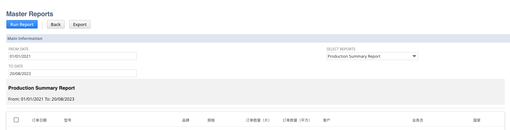

# 📊 Master Reports Suitelet

This Suitelet script 📜 empowers you to generate and visualize a variety of reports sourced from saved searches within NetSuite. It offers a user-friendly interface for choosing 🗂️ report parameters, executing saved searches, and exporting the outcomes to Excel 📈.

## 🧩 Prerequisites

- NetSuite account with SuiteScript 2.1 support.

## 🚀 Installation

1. Log in to your NetSuite account.
2. Go to **Customization > Scripting > Scripts**.
3. Click **New** to create a new Suitelet script.
4. Copy and paste the provided code into the script editor.
5. Save the script with a suitable name (e.g., "Master Reports Suitelet").
6. Deploy the script as needed.

## 📝 Usage

1. Access the Suitelet URL in your NetSuite account where you deployed the script.
2. The interface will allow you to set parameters for the report, such as the date range and the report type.
3. Click the "Run Report" button to generate the report.
4. View the report in a tabular format with options to export it to Excel using the "Export" button.

## 📸 Screenshots

*Figure 1: Master Reports Suitelet Interface*

## 📄 License

This project is licensed under the MIT License - see the [LICENSE](LICENSE) file for details.
